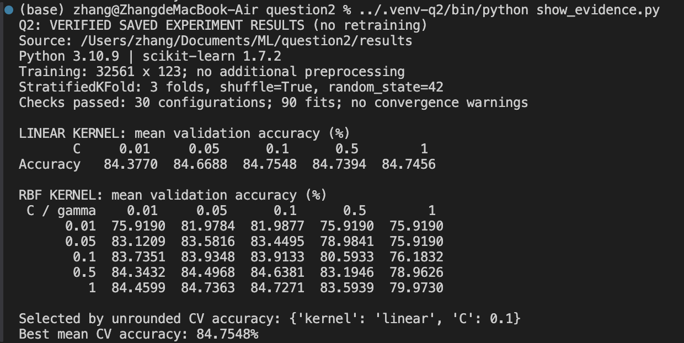
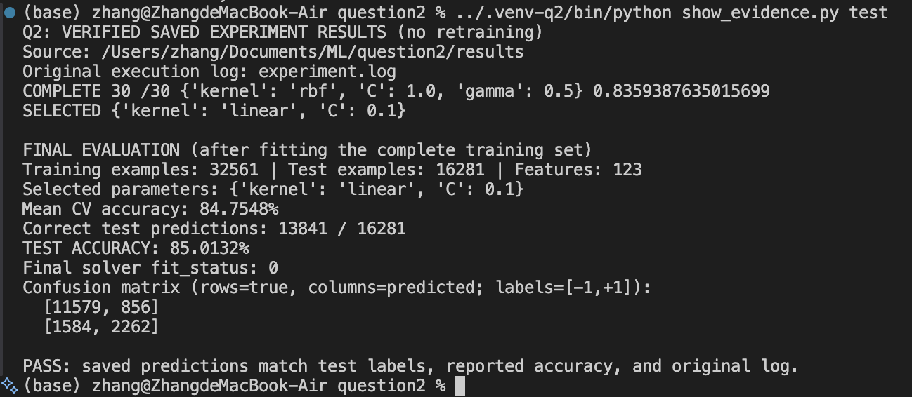

<div align="center">

# AI6102 · Machine Learning

### Mathematical foundations. Reproducible experiments.

**Machine Learning Methodologies & Applications**  
Nanyang Technological University · Zhang Minghao


[**Read the final report**](report/AI6102_Assignment.pdf) · [Original assignment](assignment/original-assignment.pdf) · [Experiment details](docs/EXPERIMENTS.md)

</div>

---

This repository brings together a completed coursework report, the original assignment brief, and the experiment records behind its SVM results. The four questions connect regularized learning, multiclass classification, margin-based optimization, and kernel regression.

## At a glance

| Selected SVM | Mean three-fold validation accuracy | Held-out test accuracy | Correct test predictions |
|:---|---:|---:|---:|
| **Linear kernel · C = 0.1** | **84.7548%** | **85.0132%** | **13,841 / 16,281** |

The selected model was refitted on all **32,561 training examples** before the single final test evaluation. Selection used unrounded mean validation accuracy across the prescribed grid; the test set was not used for tuning. These figures are experiment results, not an assignment grade.

## What the report covers

| Question | Topic | Main contribution | Marks available | Report pages |
|:---|:---|:---|---:|:---|
| **Q1** | Regularized multiclass logistic regression | Reference-class probability model, cross-entropy objective, gradient derivation, and learning procedure | 10 | 1–3 |
| **Q2** | SVM classification on a9a | Linear/RBF parameter search, fixed stratified three-fold validation, and final test evaluation | 5 | 4–8 |
| **Q3** | Soft-margin SVM and structural risk | Elimination of slack variables and an equivalent hinge-loss formulation | 5 | 8–10 |
| **Q4** | Kernelized regularized regression | Feature-space derivation, kernel-matrix closed form, and prediction rule | 5 | 10–12 |

The [assignment guide](docs/ASSIGNMENT_GUIDE.md) maps each requirement to the corresponding deliverable and lecture reference. The final PDF is preserved exactly as exported by the author.

## Reproduce or verify

Use **Python 3.10** and `curl`. From a local clone:

```bash
git clone https://github.com/sooyaa-103/AI6102-ML-Assignment.git
cd AI6102-ML-Assignment
python3.10 -m venv .venv
source .venv/bin/activate
python -m pip install -r question2/requirements.txt
```

### Inspect the recorded run

```bash
# Read and check all 30 saved cross-validation results.
python question2/show_evidence.py cv

# Download the official data and verify their recorded SHA-256 hashes.
python question2/download_data.py

# Check saved test predictions against the official test labels and run log.
python question2/show_evidence.py test
```

These commands verify existing records; they do not retrain the models.

### Run the full experiment again

```bash
python question2/run_experiment.py
```

This performs **90 cross-validation fits and one final refit**, using six worker processes and a 512 MB kernel cache per SVC. It downloads missing data and replaces the local experiment records. Runtime depends on the machine. All settings and the complete accuracy tables are documented in [EXPERIMENTS.md](docs/EXPERIMENTS.md).

## Experimental evidence

The screenshots included in the report show terminal verification of saved experiment records. The underlying fold statistics, validation indices, test predictions, and original execution log are retained in the repository.

<details>
<summary><strong>View cross-validation evidence</strong></summary>



</details>

<details>
<summary><strong>View final test verification</strong></summary>



</details>

## Repository map

```text
AI6102-ML-Assignment/
├── report/                       Final 12-page assignment PDF
├── assignment/                   Unmodified original assignment brief
├── assets/                       Experiment evidence screenshots
├── docs/
│   ├── ASSIGNMENT_GUIDE.md        Question scope and submission requirements
│   └── EXPERIMENTS.md             Protocol, full tables, and provenance
├── question2/
│   ├── run_experiment.py         Complete SVC experiment
│   ├── download_data.py          Official data download and hash checks
│   ├── show_evidence.py          Verification of saved experiment records
│   ├── requirements.txt          Pinned numerical-library versions
│   ├── experiment.log           Original training execution log
│   └── results/                  Fold records, splits, predictions, metadata
└── .gitignore                    Local environments, data, and build outputs
```

Only the final PDF is available for the complete report; a full Overleaf source project is not included. Course slide decks and unrelated project files are not part of this repository. Dataset files are fetched from their official source rather than committed.

## References and attribution

- AI6102 lecture material: L3 (linear regression), L4 (linear classification), and L5 (SVMs and kernel methods).
- [Original assignment brief](assignment/original-assignment.pdf), preserved for reference. Its title uses **AI6012**, while the supplied lectures and final report use **AI6102**.
- [LIBSVM a9a dataset](https://www.csie.ntu.edu.tw/~cjlin/libsvmtools/datasets/binary.html#a9a), a preprocessed version of Adult.
- [scikit-learn 1.7 SVM documentation](https://scikit-learn.org/1.7/modules/svm.html).

This is a personal coursework archive, not an official course solution or grading record. Original teaching material and external datasets remain attributed to their respective creators.
